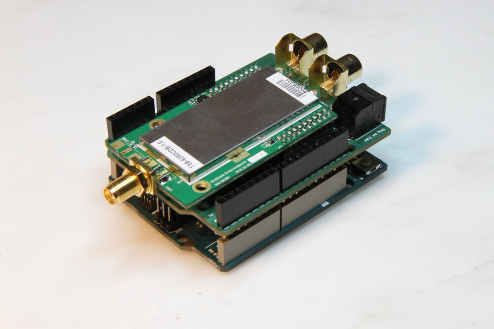
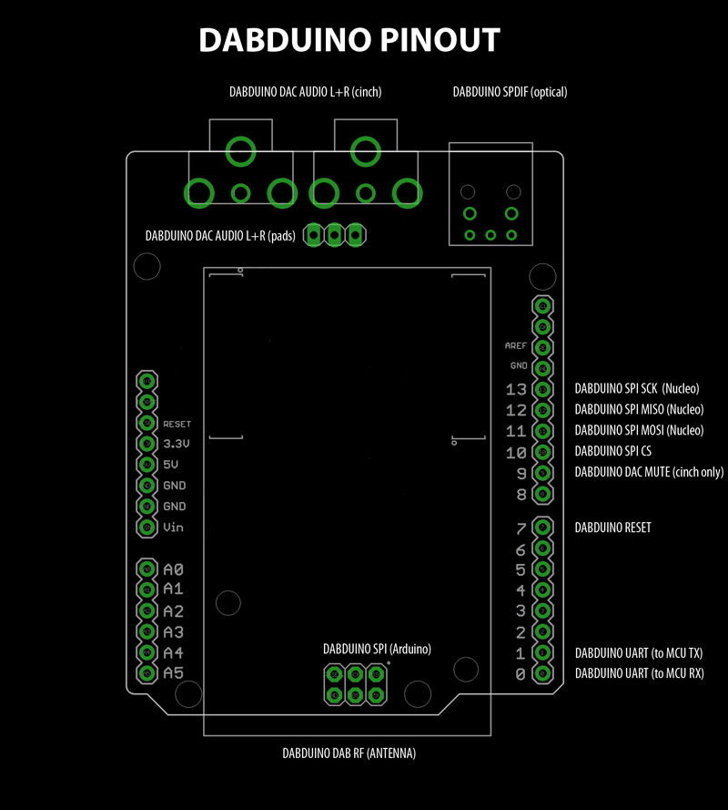

## What is the DABDUINO?
The DABDUINO is Arduino DAB/DAB+ (digital radio) + FM shield based on Keystone T3B module and with 32-bit, 384kHz PCM DAC (cinch) + SPDIF optical digital audio output. The DABDUINO shield is compatible with 3.3V boards (Zero, M0, M0 PRO, Due etc.). DABDUINO Library is designed specifically to work with the DABDUINO and works too with Keystone T3B module.

The library support many function for control DABDUINO and for access to broadcast data. For example - automatic station search and store station in database, watching and readind DAB/DAB+ and RDS station name, program type, broadcast texts and data, signal strength and quality, volume and stereo mode settings and many others. In near future I will add function for access to media data from DAB/DAB+ stream. For example - images, audio stream, etc. 

The DABDUINO is good starting point for high quality DIY DAB/DAB+/FM home receiver project. Optical audio outout (SPDIF) and 32-bit, 384kHz PCM DAC offer the same audio quality as expensive DAB/DAB+ receivers.

## How to install
Open library manager in Arduino IDE and install the DABDUINO library.

## References
For command reference visit [DABDUINO.cpp](https://github.com/turbyho/DABDUINO/blob/master/src/DABDUINO.cpp). 
Example is here [DABDUINO_example_1.ino](https://github.com/turbyho/DABDUINO/blob/master/examples/Dabduino_example_1/DABDUINO_example_1.ino).

## Have some problem or questions?
Send me [mail](mailto:turbyho@gmail.com) :)

## Where buy the DABDUINO?
I waiting for first batch of DABDUINO boards. First boards will be ready for dispatch on 05/2017. Send me preorders by email please.

## Final DABDUINO

### Second prototype video

### First prototype video

### Pinout

