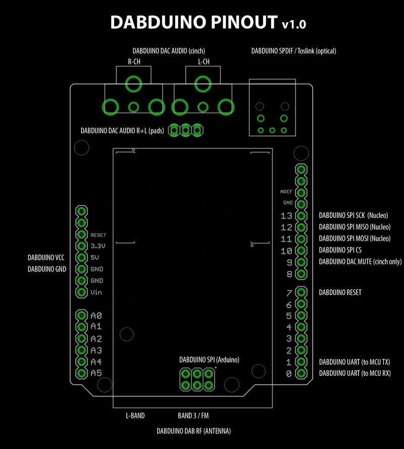

## What is the DABDUINO?

The DABDUINO is good starting point for high quality DIY DAB/DAB+/FM home receiver project, car receiver or anything you want. Optical audio outout (SPDIF/Toslink) and 32-bit, 384kHz PCM DAC offers the same audio quality as expensive DAB/DAB+ receivers.

The DABDUINO is Arduino DAB/DAB+ (digital radio) + FM shield with 32-bit, 384kHz PCM DAC (cinch) + SPDIF/Toslink optical digital audio output. DABDUINO Library is designed specifically to work with the DABDUINO.

The library supports many functions for control DABDUINO and for access to broadcast data. For example - automatic station search and store stations in database, watching and reading DAB/DAB+ and FM station name, program type, information texts and data from DAB/DAB+/FM RDS, signal strength and quality, volume and stereo mode settings and many others. In near future I will add functions for access to media data from DAB/DAB+ stream. For example - images, audio stream, etc. 

**Compatibility:**
* Arduino (as shield): DUE, ZERO, M0, M0 PRO, TIAN, PRIMO 
* Arduino (wired): MKRZero, MRK1000 

> _Generally all Arduino 3.3V boards_
> _Arduino 5V boards only with level shifting (5V/3.3V)_
> _SPI is not needed for common operation (only for access to media data)_

* STM32 (as shield): Nucleo L476RG, Nucleo F091RC, Nucleo F103RB
* STM32 (wired): STM32F103C8T6 

> _Generally all supported boards in [Arduino_STM32](https://github.com/rogerclarkmelbourne/Arduino_STM32)_

**Bands:**
* DAB/DAB+: BAND III, CHINA BAND, L-BAND
* FM: 87.5 - 108MHz

**Input:**
* RF (antenna): SMA connector, solder pads

**Output:**
* Analog audio: 32-bit, 384kHz PCM DAC - stereo cinch (golden), solder pads
* Digital audio: SPDIF / Toslink (optical)

**Real Time Clock (RTC):**
* on board, synchronised from DAB/DAB+ stream 

**Power:**
* DABDUINO is powered only from Arduino pin heads. No need external power source. 

## How to install
Open library manager in Arduino IDE and install the DABDUINO library.

## References
For command reference visit [DABDUINO.cpp](https://github.com/turbyho/DABDUINO/blob/master/src/DABDUINO.cpp). 
Example is available here [DABDUINO_example_1.ino](https://github.com/turbyho/DABDUINO/blob/master/examples/Dabduino_example_1/DABDUINO_example_1.ino).

## Have some problem or questions?
Send me [email](mailto:turbyho@gmail.com) :)

## Final DABDUINO

### Second prototype video

### First prototype video

### Pinout

